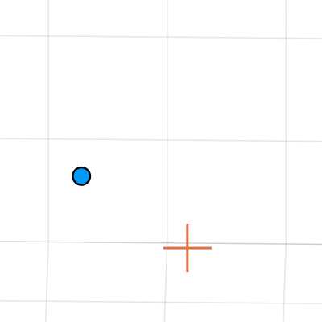

# Category-Level Shape and Pose Estimation in Less Than a Millisecond
[[Paper](https://arxiv.org/abs/2509.18979)] [[Video](TODO)]

Official Julia implementation of "Category-Level Object Shape and Pose Estimation in Less Than a Millisecond"
by Lorenzo Shaikewitz, Tim Nguyen, and Luca Carlone

  One Run                  |  Multiple Minima
:-------------------------:|:-------------------------:
|


This repository contains the *solver*. We open-source keypoint detection and training [here]().

## Quick Start
First, make sure you have [Julia installed](https://julialang.org/install/). This repository was tested with v1.11.6. Then, clone the repository and follow the directions below. We assume you are in the repo folder.
1. Clone this repository
```shell
git clone https://github.com/lopenguin/Fast-ShapeAndPose.git
cd Fast-ShapeAndPose
```
2. Open the Julia REPL
```shell
julia --project
```
3. Install dependencies
```julia-repl
using Pkg
Pkg.add(url="https://github.com/lopenguin/SimpleRotations.jl")
```

That's it! I've prepared a simple demo script which measures runtime and plots the SCF iterates:
```julia-repl
julia> include("scripts/demo_pace.jl")
```

The script may take a bit to run the first time while Julia precompiles it, but after that it should be much faster!

## Reproducing Results
First, download the data for each experiment:
```shell
wget -O data.zip "https://drive.usercontent.google.com/download?id=1Z229oE_R27QneU0_GCJS2oH3yznJ8KdF&export=download&confirm=yes"
unzip data.zip -d data
rm data.zip
```
You can also download [from Google drive](https://drive.google.com/file/d/1Z229oE_R27QneU0_GCJS2oH3yznJ8KdF/view?usp=sharing) and put it in a "data" folder.

Now, you can print a summary of any of the experiments by calling:
```shell
julia --project synthetic.jl
# cast.jl, nocs.jl, apollo2.jl
```

To re-run a specific experiment, add the method name and `--force`. For example:
```shell
julia --project synthetic.jl SCF --force
```

Running multiple methods together allows Julia to precompile for the specific problem data, which artificially increases the runtime of the second or third method.

Below, we provide more details on each of the experiments.

<details closed>

<summary><b>Synthetic Experiments</b></summary>

The synthetic experiment data is all in [this file](./data/synthetic/problem_data.dat). All methods have the same initial condition. The problem data is generated using:
```julia
q0 = normalize(randn(4))
serialize("data/synthetic/problem_data.dat", (data,q0))
```

</details>


<details closed>

<summary><b>CAST Experiments</b></summary>

We test on the [CAST dataset](https://github.com/MIT-SPARK/certifiable_tracking?tab=readme-ov-file). First, we run the fast compatibility checks [ROBIN](https://github.com/MIT-SPARK/ROBIN) using [this python script](./assets/run_robin.py). This saves the inlier clique to the "robin_" json file along with the time it takes to run ROBIN. For visualization, see [scripts/visualization/cast.jl](./scripts/visualization/cast.jl). The keypoint detector is not released.

</details>


<details closed>

<summary><b>NOCS Experiments</b></summary>

We test on the [NOCS-REAL275 dataset](https://github.com/hughw19/NOCS_CVPR2019). Keypoint detection is done separately. Save files are [available here](https://drive.google.com/drive/folders/17MErjAilASvz6tpw6yex0OqWEbcueMBA?usp=sharing) and scripts to run keypoint detection are [available here](https://github.com/Piflyer/keypoint-tracking). We caution that keypoint detection doesn't work particularly well.

To run on NOCS, you also need to specify the subfolder (see data/nocs). For example:
```shell
julia --project nocs.jl SCF mug --force
```

There are also several visualization scripts in the `visualization` folder.

</details>


<details closed>

<summary><b>ApolloCar3D Experiments</b></summary>

Unfortunately, most ApolloCar3D data is no longer available at their [official repository](https://github.com/ApolloScapeAuto/dataset-api). We use the code in this repository to process the dataset. While we don't have access to the original images, the keypoint detections are provided in the data.

</details>

## BibTeX
```
@misc{Shaikewitz25arxiv-FastShapeAndPose,
      title={Category-Level Object Shape and Pose Estimation in Less Than a Millisecond}, 
      author={Lorenzo Shaikewitz and Tim Nguyen and Luca Carlone},
      year={2025},
      eprint={2509.18979},
      archivePrefix={arXiv},
      primaryClass={cs.RO},
      url={https://arxiv.org/abs/2509.18979}, 
}
```
